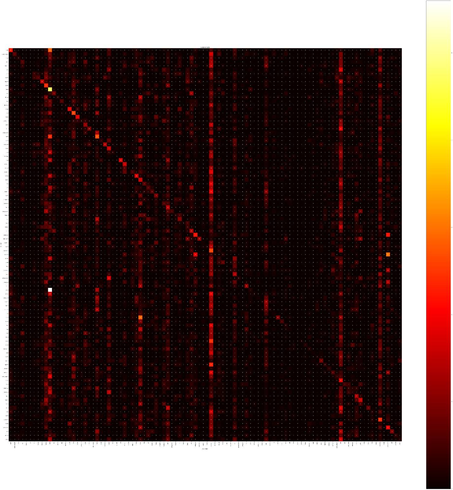

# **Redes Convolucionales - Proyecto 1**

### Por **Josmar Dominguez** (16-10315)

  

## **Introducción**

En el presente proyecto se emplea una red pre-entrenada basada en una arquitectura de CNN prediseñada (VGG16) para la clasificación de imágenes del *dataset* de CIFAR-100. Se emplea la técnica de *transfer learning* para adaptar la red a la clasificación de imágenes del dataset. Para esto se usa ```PyTorch``` y ```torchvision```.

## **Resultados**
Para 20 épocas se tuvo una precisión de 97.45% para el *dataset* de entrenamiento y 65.43% para el *dataset* de test.
Esto se puede apreciar en la matriz de confusión que se genera al evaluar el modelo con el dataset de test:

Luego, al visualizar los **mapas característicos** de algunas clases, se pueden concluir algunas cosas:
- Para la clase de **chimpancé** pareciera fijarse en la cara del animal, especialmente en la forma alargada del acara y la redondez de la nariz.
- Para la clase de **conejo** se fija en la forma de perfil del cuerpo, circular, con cierta joroba y patas largas hacia adelante. Es por esto que al recibir un camello en la posición de perfil, es posible que lo confunda con un conejo.
- Para el caso de la **langosta** ocurre algo similar, pareciera fijarse en las protuberancias del cuerpo, y lo alargado del cuerpo. Al recibir una abeja desde una perspectiva superior es posible que la confunda con una langosta.
- Del **teléfono** pareciera fijarse en la forma rectangular del cuerpo y en búsqueda de una pantalla y botones.
- Para la **bicileta** pareciera fijarse en la forma del cuadro, y en la forma de las ruedas, que son grandes y delgadas.
- Por otro lado, para las **motocicletas** es posible que se fije también en las ruedas, pero que son más pequeñas y gruesas.
- En el caso de la **lámpara** pareciera fijarse en buscar figuras básicas como círculos, cuadrados y triángulos, sobre una base irregular.
- Para las **casas** pareciera fijarse en la forma de la casa, que es rectangular, con un techo triangular, y una puerta y ventanas rectangulares. Muchas líneas rectas.
- Para el caso de chica y chico, o mujer y hombre, sería apropiado hacer un análisis exclusivo para cada uno, pero pareciera fijarse en el cabello y la forma de la cara.

## **Uso de API [WIP]**
Para el uso de la API (wip) se debe enviar una petición ```POST``` a la dirección ```(ADDRESS)``` con el siguiente formato:
```
{
    "image": "base64 encoded image",
}
```
### 200 OK
Si la petición es exitosa, se obtiene una respuesta con el siguiente formato:
```
{
    "class": "class_name",
    "confidence": "confidence_value"
}
```
### 400 Bad Request
Si la petición no es exitosa, se obtiene una respuesta con el siguiente formato:
```
{
    "error": "error_message"
}
```
### 500 Internal Server Error
Si ocurre un error interno en el servidor, se obtiene una respuesta con el siguiente formato:
```
{
    "error": "error_message"
}
```

## **Comentarios**

En un principio se intentó diseñar y entrenar directamente dos modelos, uno basado en la arquitectura VGG16 y otro en ResNet50. Sin embargo, para el caso de **VGG16** se logró entrenar, con un buen desempeño en el entrenamiento, pero en la validación se obtuvo un desempeño muy pobre, como se puede observar en la siguiente gráfica:

Donde se aprecian clases particulares para las cuales en ocasiones, independientemente de la clase que sea la imagen, se predicen como si fuesen de estas clases. Es posible que el modelo no haya podido identificar bien el patrón para estas clases, por lo que las toma como la *solución genérica*.
Para el caso de la red **ResNet50** no se logró entrenar porque había un problema de dimensiones al momento de hacer la suma residual característica de este modelo. Sin embargo, es un objetivo que no se descarta.